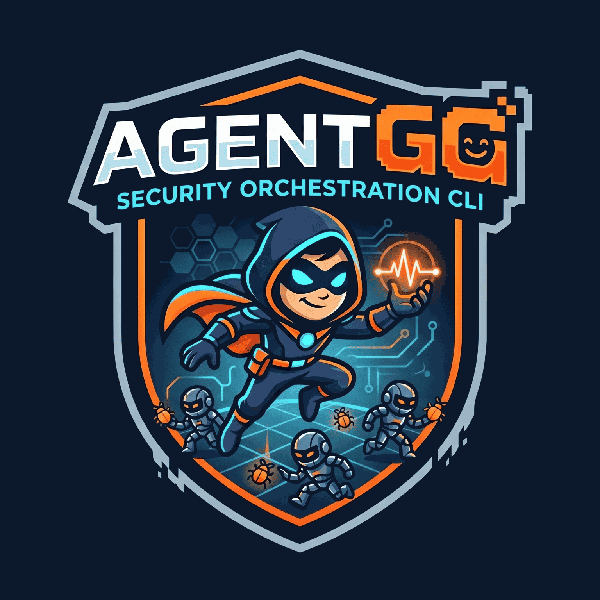

# agentgg-agents

<p align="center">
  
</p>

The official agent library for [agentgg](https://github.com/agentgg-dev/agentgg) — AI-powered SAST agents for code security review.

The library ships two kinds of templates:

- **Agents** — `.md` files with `mode: file`, `walker`, or `hunt`. The frontmatter is metadata, the markdown body is the LLM prompt. Each agent costs LLM tokens to run.
- **Rule templates** — `.md` files with `mode: rule`. Regex-only, no LLM. They scan files matching their `filePatterns` with the patterns in `preFilter` and emit candidate hits, which seed downstream walker agents. Free to run. The markdown body is documentation only — the runtime never sends it to a model. **These are not agents** in the LLM sense; they reuse the same file format so the CLI can manage them uniformly.

Both are downloaded automatically by agentgg on first scan and updated with `agentgg agents update`.

## Directory structure

```
agentgg-agents/
├── demo-agents/      # Small curated set — one agent per mode (file / walker / hunt) for a quick first scan via `-t demo-agents/`
└── base/             # Full vulnerability library, organized by category — runs automatically when no -t flag is given
    ├── injection/    # SQL, NoSQL, command, XSS, path traversal, mass assignment
    ├── auth/         # Authentication, authorization, JWT, OAuth, session, IDOR
    ├── exposure/     # Secrets, env vars, error leaks, debug endpoints
    ├── misconfiguration/ # CORS, caching, cookies, feature-flag security
    ├── logic/        # Race conditions, async bugs, event handler mismatches
    ├── infrastructure/ # Docker, Kubernetes, Terraform, GitHub Actions
    ├── cloud/        # AWS Lambda, GCP, Azure, IAM
    ├── cryptography/ # Insecure algorithms, unsafe deserialization
    ├── mobile/       # Android, iOS
    ├── ai/           # LLM/agent security, MCP, prompt injection
    └── entry-points/ # Rule templates (mode: rule) — regex-only, no LLM.
                      # Locate route handlers / controllers / queue
                      # workers per framework and seed candidates into
                      # walker agents. Tech-gated (e.g. only fires on
                      # Laravel repos).
```

## Usage

agentgg downloads and manages agents automatically. No manual setup needed.

**Default scan** — runs the full `base/` vulnerability library:

```bash
agentgg scan ./src
```

**Run the quick `demo-agents/` set** (one agent per mode — file / walker / hunt — for a fast first scan):

```bash
agentgg scan ./src -t demo-agents/
```

**Run a specific category:**

```bash
agentgg scan ./src -t base/injection/
agentgg scan ./src -t base/auth/
```

**Run multiple categories:**

```bash
agentgg scan ./src -t base/injection/ -t base/auth/
```

**Run a single agent by slug:**

```bash
agentgg scan ./src -t sql-injection
```

**Update to the latest agents:**

```bash
agentgg agents update
```

## Agent format

Each agent is a `.md` file:

```markdown
---
slug: sql-injection
name: SQL Injection
description: SQL queries built by concatenating untrusted input instead of using parameterized queries.
version: 0.1.0
author: your-github-handle
mode: file
noiseTier: normal
filePatterns:
  - "**/*.{ts,js,py,rb,go,rs,php,java,cs}"
references:
  - CWE-89
  - OWASP-A03:2021
---

You are reviewing source code for SQL injection...
```

### Frontmatter fields

| Field | Description |
|---|---|
| `slug` | Unique identifier, kebab-case. Used with `-t`. Must match the filename (`<slug>.md`). |
| `name` | Human-readable name. |
| `description` | One-line summary shown in `agentgg agents list`. |
| `version` | Semver string. |
| `author` | Your GitHub username, Twitter handle, or alias. Your name ships with the agent. Use `agentgg` for official agents. Optionally add a full profile in [`contributors.json`](contributors.json). |
| `mode` | `file` (one LLM call per matching file), `walker` (agentic batches), `hunt` (whole-repo exploration), or `rule` (regex-only, no LLM — see below). |
| `noiseTier` | `precise`, `normal`, or `noisy` — how many false positives to expect. |
| `filePatterns` | Glob patterns for files this agent should scan. |
| `tech` | Optional tech gate. The template only runs if at least one tag appears in `fingerprint(root).tags` (e.g. `[laravel]`, `[fastapi]`). Empty/absent = always runs. |
| `references` | Optional. CWE, CVE, or OWASP identifiers — helps users triage findings and report to their security team. |

## Rule templates (`mode: rule`)

Rules are **not LLM agents**. They run pure regex over files matching `filePatterns` and emit candidate hits. The markdown body is documentation for humans; the runtime never sends it to a model.

```markdown
---
slug: php-laravel-route
name: Laravel Route Entry Points
description: Locates Laravel route registrations, controller actions, and SQL surface markers via regex — no LLM cost.
version: 0.1.0
author: agentgg
mode: rule
tech: [laravel]
noiseTier: noisy
filePatterns:
  - "**/routes/**/*.php"
  - "**/app/Http/Controllers/**/*.php"
preFilter:
  - regex: "Route::(get|post|put|patch|delete|any|match)\\s*\\("
    label: "Route::* registration"
  - regex: "DB::raw\\s*\\("
    label: "DB::raw (SQL injection if interpolated)"
references:
  - CWE-89
---

Documentation body — not sent to any model.
```

### How rule hits are used

Rule hits seed the walker pool. For any file the rule flagged, any walker agent whose `filePatterns` overlap that file picks up the rule's hits as additional anchors, alongside the walker's own `preFilter` hits. Same investigation prompt, same batching — the rule's slug just shows up in the scanner context.

Files where a rule fired but no walker agent overlaps are currently orphan (not investigated). Pair rule templates with a walker that covers the same stack (e.g. `php-laravel-route` + `missing-auth-php`).

### Rule-template-specific fields

| Field | Description |
|---|---|
| `preFilter` | Required. List of `{ regex, label }` pairs. Each `regex` is a per-line JS-flavor pattern; YAML strings must double-escape backslashes (`\\s` for `\s`). Each `label` appears in the scanner context the walker sees so the model knows *why* the line was flagged. |
| `tech` | Strongly recommended for rules. Rules are noisy by design — gate them on framework detection so they only fire on relevant repos. |

## Contributing

See [CONTRIBUTING.md](CONTRIBUTING.md) for the full guide. In short:

1. Fork this repo
2. Add a new `.md` agent in the appropriate category folder (slug rules in the schema above)
3. Test it locally: `agentgg scan ./test-fixture -t ./your-agent.md`
4. Lint the whole tree: `agentgg agents lint .`
5. Open a pull request

New agents should have:
- A focused, single-responsibility prompt
- Clear true-positive and false-positive criteria in the prompt body
- Tight `filePatterns` to avoid scanning irrelevant files
- A CWE / CVE / OWASP reference when one fits (optional)

New rule templates (`mode: rule`) should:
- Live under [`base/entry-points/`](base/entry-points/)
- Carry a `tech:` gate so they don't fire on irrelevant repos
- Pair with at least one walker agent whose `filePatterns` cover the same files (otherwise the rule's hits are orphaned)
- Compile under `new RegExp(...)` — `agentgg agents lint .` catches malformed patterns

## Related

- [agentgg](https://github.com/agentgg-dev/agentgg) — the CLI that runs these agents
